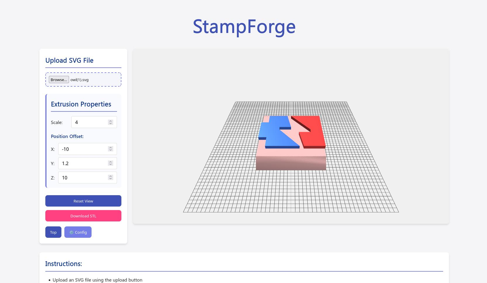

# StampForge 

**⚠️ ALPHA VERSION:** This tool is currently under active development

StampForge is an open-source tool for creating 3D models from SVG files, designed for easy 3D printing of custom stamps and similar objects.



## 👤 Author

**Created by Petar Miletić** - [github.com/itzpere](https://github.com/itzpere)

## 🔴 Essential Downloads

**[DOWNLOAD STAMP HOLDER](https://www.printables.com/model/1285748-stampforge-customizable-svg-to-stamp)** - This holder is required to use your created stamps

## Features

- Import SVG files and convert them to 3D models
- Adjust extrusion scale on working plane
- Position the extrusion on the stamp base
- View models in real-time 3D
- Export models as STL files for 3D printing
- Browse the SVG gallery to quickly select designs

## Installation

1. Clone the repository:
   ```
   git clone https://github.com/itzpere/stamp-forge.git
   cd stamp-forge
   ```

2. Install dependencies:
   ```
   npm install
   ```

3. Start the server:
   ```
   npm start
   ```

4. Open your browser and navigate to:
   ```
   http://localhost:3000
   ```

## Usage

1. **Upload an SVG**: Use the upload button to select an SVG file from your computer
2. **Customize**: 
   - Adjust the extrusion height
   - Set the scale to size the design
   - Position the design on the stamp base using the X, Y, Z offset controls
3. **Preview**: Rotate, pan, and zoom to inspect your 3D model
4. **Export**: Click "Download STL" to export your model for 3D printing

## Printing Tips

For best results when 3D printing your stamps:

- **Enable ironing** on top-most surfaces in your slicer for a smooth finish on the stamp face
- Use a relatively high infill (40%+) for durability
- Consider printing with a flexible material for better stamping results

## ⚠️ Known Issues

- **Positioning System Instability:** The positioning system in the current alpha version is unstable. If you experience issues, try refreshing the page.
- This is an alpha version with ongoing development to improve stability and features

## Additional Resources

- [Printables Page](https://www.printables.com/model/1285748-stampforge-customizable-svg-to-stamp) - See examples and share your prints
- [Onshape Design](https://cad.onshape.com/documents/b8df565e3ee5bf1496f24090/w/ae81aeeee47b9edd37d47bd6/e/7bbac46e537c734a00283271?renderMode=0&uiState=6817b59c4f958a65368d6c7d) - View and modify the source CAD

## SVG Resources

Here are some great resources for finding SVG files to use with StampForge:

- [SVG Repo](https://www.svgrepo.com/) - Free SVG icons and vectors
- [SVG Repo](https://www.svgrepo.com/collection/chunk-16px-thick-interface-icons/) - Chunk 16px

## SVG Gallery

StampForge includes a built-in SVG gallery. To use it:

1. Add SVG files to the `/svgs` directory in the project root
2. Refresh the gallery using the refresh button
3. Click on any SVG thumbnail to load it into the editor

## Contact & Support

If you encounter any issues or have questions, please reach out through:

- **Email**: [04.petar.miletic@gmail.com](mailto:04.petar.miletic@gmail.com)
- **GitHub**: [Project Repository](https://github.com/itzpere/stamp-forge)
- **Printables**: You can also contact me through Printables messages
- **Bug Reports**: Please report any issues via email or GitHub

## Acknowledgments

- Three.js for 3D rendering
- SVGLoader for SVG parsing and conversion

## Contributing

Contributions are welcome! Please feel free to submit a Pull Request.

## Development Status

This project is currently in **ALPHA** status. I am actively working on:

- Improving positioning stability
- Adding more features
- Enhancing user experience
- Fixing bugs

Feedback and bug reports are very welcome!
